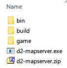

# Running your own map server

There are two ways to run the map server, the easy way (this page) or using docker, see [DOCKERSERVER.md](./DOCKERSERVER.md)

## Installation

You can find the latest version here:
https://github.com/joffreybesos/d2-mapserver/releases/latest

- Download the `d2-mapserver-vxxx.zip` file from the above link.
- Extract the zip file to it's own folder.
- Download the D2 LoD game files - [zip download link](https://mega.nz/file/EgdmXT7C#sRNJGN-QlB24-9jqaI5DBWgFrbCw0Bezj-S0aY_Jn6k).
- Extract the D2 LoD game files to a folder called `game` in your `d2-mapserver` folder  
    Your files should look like this:  
      
- Double click the `d2-mapserver.exe` executable  

You should see a window popup with the text `Running on http://localhost:3002`  
If you see this then the map server is running.  
Minimize this window, if you close it the map server will stop.  

You should then be able to access this URL in your browser <http://localhost:3002/v1/map/12345/2/117/image>  
In your d2r-mapview `settings.ini` change the baseUrl to `baseUrl=http://localhost:3002`  

You should then be able to start using the map hack.
