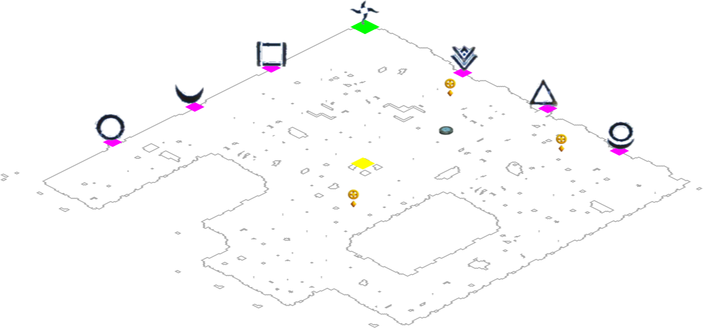
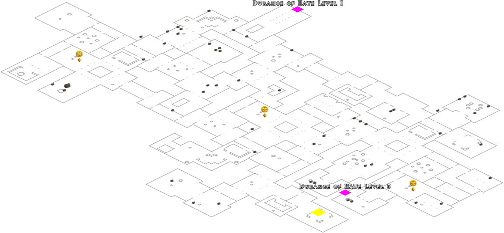
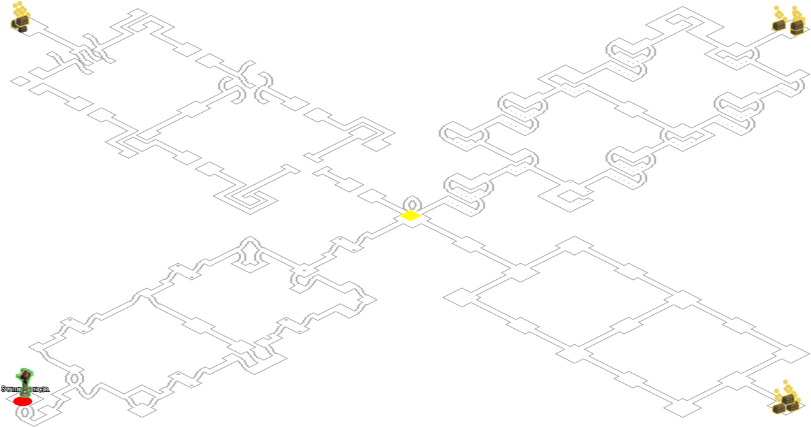

# D2 Map server

This is a REST API to serve Diablo 2 maps for a given seed, difficulty, and map id.

In Diablo 2 and Diablo 2 Resurrected, the maps are randomly generated based on a seed value.
This will take that seed value (and difficulty) and use Diablo 2 (classic)'s map generation to extract collision data.

This data can then be used to render an image of the map.

This repo leverages this package - [blacha/diablo2](https://github.com/blacha/diablo2/tree/master/packages/map).
`d2-mapserver` uses a modified version of that executable to get map data.

## Installation

See [INSTALLATION.md](./INSTALLATION.md)

## Endpoints

### Map image

Returns a PNG of the given map.

```
http://localhost:3002/v1/map/:seed/:difficulty/:mapid/image
```

e.g. <http://localhost:3002/v1/map/54534535/2/49/image>

You can also add query parameters onto the URL to change the generated image

| Parameter     | Default | Description                                                             |
| :------------ | :------ | :---------------------------------------------------------------------- |
| isometric     | false   | This will make the map appear in the normal isometric perspective       |
| trim          | false   | Trims any whitespace surrounding the map image                          |
| edge          | false   | Draws the map as an outline instead of grey blocks                      |
| wallthickness | 1.0     | Only applies for edge mode, but is the wall thickness, can be a decimal |
| serverScale   | 2       | Render scaling of the map image, larger the size the bigger the image   |
| verbose       | false   | Will mark ALL objects/NPC map data on the map image, used for debugging |

e.g. <http://localhost:3002/v1/map/54534535/2/49/image?edge=true&wallthickness=2&isometric=true>

### JSON Data

Same as above URL but without `/image`.
Returns the JSON payload used to create the map image.

```
http://localhost:3002/v1/map/:seed/:difficulty/:mapid
```

#### Seed

- 4 byte value which is written in decimal.
  Number between 0 and 4294967295

#### Difficulty

- 0 - Normal
- 1 - Nightmare
- 2 - Hell

#### MapId

- Number between 1 and 132, for each level of Diablo 2.
  Refer to `src/static/mapRefData.json` for more info.

## Map examples

| Canyon of the Magi | Durance of Hate level 2 | Arcane Sanctuary |
| :----------------: | :---------------------: | :--------------: |
|     |        |   |
